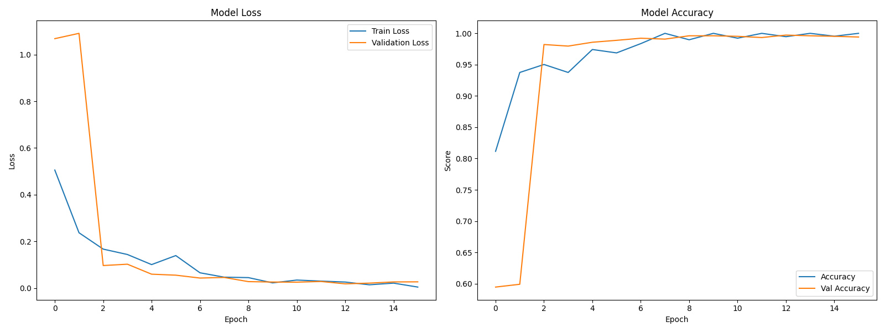

# ✋ Fingerella – The Smart Finger Classifier

**Fingerella** is a deep learning-based multi-class finger detection system that classifies hand gestures from 0 to 5 fingers using grayscale image inputs. It supports classification via **images**, **webcam video feed**, and demonstrates high performance across various test cases.

[](https://www.python.org/)
[](https://www.tensorflow.org/)
[](https://opencv.org/)
[](https://opensource.org/licenses/MIT)

---

## 🚀 Features

- 📷 Finger count classification from 0 to 5 using grayscale images.
- 🎥 Real-time finger detection using your webcam.
- 📊 Achieves **~99.97% accuracy** on the test dataset.
- 📈 Includes training metrics visualization.
- 🧠 Built using TensorFlow and Keras with data augmentation.
- 🔎 Robust model structure with dropout, batch normalization, and convolutional layers.

---

## 📁 Project Structure

```bash
Fingerella/
├── modelTraining.ipynb # Jupyter Notebook for training the classifier
├── testingOnImages.ipynb # Testing the model on static images
├── testingOnWebCam.ipynb # Real-time detection using webcam
├── fingers/ # Training and testing dataset folders ( you can download dataset from https://www.kaggle.com/datasets/koryakinp/fingers)
│ ├── train/
│ └── test/
├── testing_imgs/ # Folder for custom test images
├── fingers_detection.keras # Saved trained model
└── training_metrics.png # Loss & accuracy plots
```

---

## 🏗️ Model Overview

- Input Size: **128x128**, grayscale
- Classes: **6** (0 to 5 fingers)
- Architecture:
  - 4× Conv2D + MaxPooling + BatchNorm
  - Flatten → Dense → Softmax
- Optimizer: Adam
- Loss: Categorical Crossentropy
- Regularization: Dropout (0.2)
- Callbacks: EarlyStopping, ReduceLROnPlateau, ModelCheckpoint

---

## 📊 Results

| Metric         | Score      |
| -------------- | ---------- |
| Train Accuracy | 99.45%     |
| Test Accuracy  | **99.97%** |
| Test Loss      | 0.0084     |



---

## 🧪 How to Use

### ✅ 1. **Train the Model**

```bash
Open `modelTraining.ipynb` and run all cells.
```

This loads your dataset, trains the model, saves the best-performing model (.keras and SavedModel), and plots training metrics.

## 🖼️ 2. Test on Static Images

```bash
Open `testingOnImages.ipynb` and run all cells.
```

Put your test images in ./testing_imgs/ and see the predictions with confidence scores.

## 📹 3. Test on Webcam

```bash
Open `testingOnWebcam.ipynb` and run all cells.
```

Make sure your webcam is enabled. A bounding box will be drawn in the center of the frame where you place your hand.

## ⚙️ Requirements

Install the required Python packages:

```bash
pip install tensorflow keras opencv-python matplotlib numpy
```

## 🧠 Class Labels

```bash
| Label | Meaning           |
| ----- | ----------------- |
| 0     | 0 Fingers (Other) |
| 1     | 1 Finger          |
| 2     | 2 Fingers         |
| 3     | 3 Fingers         |
| 4     | 4 Fingers         |
| 5     | 5 Fingers         |
```

## 📌 Notes

> Images must be 128x128 grayscale.
> Webcam detection requires decent lighting and centered hand positioning and even uniform dark background ( you can use some dark sheet or file ).

## 📝 License

MIT License. Feel free to use, modify, or extend Fingerella in your own projects.
